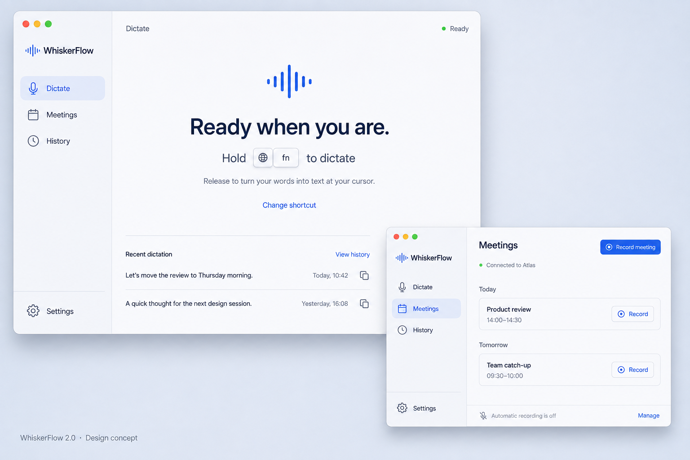

# WhiskerFlow 2.0 interface overhaul

Status: implemented locally on 4 September 2026. Debug and release builds verified; see 2026-09-04-whiskerflow-2-validation.md for evidence and runtime limits.

## Intent

Replace the wireframe-like utility interface with a finished macOS product. Make dictation immediately understandable and keep meeting recording and transcript retrieval easy to find. Preserve the working transcription, hotkey, storage, vocabulary, meeting, and update systems.

## Source observations

Reviewed ContentView, TranscriptDetailView, SettingsView, OnboardingView, MenuBarView, RecordingHUD, StatsView, AppState, and WhiskerFlowApp on 4 September 2026.

- Live UI inspection also shows the restored sidebar compressed enough to wrap the product name and heavily truncate transcript rows. The new layout must enforce usable navigation and list widths.
- The root view opens a two-pane transcript archive even when the user wants to dictate. Empty history produces two competing empty states.
- Meeting scheduling and capture actions are buried in the General settings tab.
- First-run setup combines dictation permissions, system audio permissions, Atlas sign-in, model preparation, storage, and optional Apple Speech permission in a fixed-height sheet.
- Model terminology, metadata, and operational status compete with everyday tasks.
- Transcript edits require explicit saving and can be lost when changing selection. Draft synchronization observes record identity, not transcription completion for the same record.
- Shortcut instructions always say “Hold”, although the app supports toggle recording. Instructions also need to respect output delivery settings.
- Search with no matches has no specific empty state.
- Stats derive from retained transcript records; the design must not promise durable lifetime totals without a separate analytics implementation.
- Menu bar actions need the same capture transition guards as the meeting workspace.
- Existing uncommitted meeting code and Settings changes belong to ongoing work and must be preserved.

## Alternatives considered

1. Menu-bar-only product: very compact, but hides meetings, history, and recovery. Not recommended for 2.0.
2. Unified activity dashboard: puts dictation, meetings, and statistics together, but creates competing actions and visual noise.
3. Focused workspace with three destinations: recommended. Dictate is the starting point, Meetings contains its own setup and calendar, and History is a text workspace.

## Visual concept

This image uses illustrative data. In implementation, Globe/fn is one keycap, not two separate keys as drawn in the concept. Native components must remain keyboard accessible and adapt to light and dark mode.

## Visual direction

A calm recording instrument rather than an admin dashboard. Native window controls, a narrow translucent navigation rail, a spacious detail surface, subtle separators, and a restrained blue accent. No marketing copy inside the app, oversized statistics, decorative gradients, or repeated cards around every control.

Proposed reference palette: Paper #F5F7FA, Ink #17243A, Slate #637087, Cobalt #365FE8, Mist #E6ECF8, Recording #C94352. These become semantic light/dark tokens, not hardcoded light backgrounds. Dark mode uses native adaptive surfaces and readable accent variants.

Typography: SF Pro Rounded, medium weight, for the product name and a small number of large headings; SF Pro Text for controls and content; SF Mono only for shortcut keycaps, timestamps, and recording duration. Body text remains comfortably readable at 14–16 pt.

Signature: a compact waveform beside a tactile shortcut keycap. The waveform responds to actual input level while recording. It rests when idle; reduced-motion settings are respected. It must not suggest that audio is being captured when it is not.

## Navigation and screens

### Dictate

Default destination. A small readiness indicator, one large shortcut instruction, and one sentence explaining the current delivery behavior. Hold-to-talk says “Hold [shortcut] to dictate”; toggle says “Press [shortcut] to start” and explains pressing again to finish.

The actual shortcut remains the primary interaction: a clickable fake record button must not steal focus from the user's intended paste destination. Provide a small “Change shortcut” settings link.

A compact recent-text section below the main interaction shows up to three genuine transcripts. Clicking opens History at that record. Copy has a visible confirmation. No fabricated records in the application.

Permission failures appear as one actionable setup message. Preparing, recording, transcribing, success, and failure have distinct states. Failure offers the appropriate retry or settings action and does not erase the last successful transcript.

### Meetings

Meeting recording becomes a top-level workspace. Show active recording first, with title, explicit recording status, and a prominent Stop action. Otherwise show the upcoming seven-day schedule with Refresh and a clear Record meeting action.

When unconnected, show a single “Connect Atlas” entry and explain what it enables. Request system-audio permission only for this workflow. Do not imply a connected account proves recording works. Surface actual model, permission, storage, and upload problems in plain language, with further detail disclosed on demand.

Automatic capture is an explicit opt-in with an explanation of calendar eligibility. Preserve existing schedule eligibility and overlap policy. Use stable event identity where the capture model exposes it; do not identify an active event by title alone.

Keep previous seven-day events in a secondary section. “In Atlas” is a status only unless the existing API supplies a supported destination URL. Disable start actions during capture transitions; keep stop discoverable while recording.

### History

Searchable text workspace with a compact dated transcript list and a comfortable editor. Clear empty-history and no-search-results states. Search has a visible clear action.

The selected transcript shows a readable date/title, quiet duration/word count, and a primary Copy action. Engine information moves into details. Retry appears only when relevant. Export remains available for Markdown, CSV, and JSON.

Protect unsaved edits with an explicit save/discard/cancel guard before navigation or deletion. Never silently overwrite a dirty draft when the record changes. Synchronize completed transcription when the current draft is clean. Copy copies exactly the visible text, including an intentionally empty draft.

Deletion requires a clear confirmation because there is no existing trash recovery. Preserve vocabulary correction suggestions, presented as a compact optional follow-up after saving.

### Setup

A short sequence focused on dictation: introduce the shortcut, enable microphone, enable accessibility for pasting, then show the ready state. Reflect permission results after returning from System Settings. Optional speech fallback belongs with that engine, and meeting permissions belong in Meetings.

Do not require Atlas sign-in to complete dictation setup. Explain permissions in terms of the user's action. Do not state readiness from permission flags alone if the hotkey monitor or model reports a failure.

### Settings

A dedicated macOS Settings window with a simple category list: Dictation, Text, Meetings, App, Advanced. Keep actual meeting schedules and live recording controls out of Settings.

Dictation: shortcut, hold/toggle mode, microphone, language, delivery. Text: formatting and vocabulary replacements. Meetings: automatic capture and connection configuration. App: login, Dock/menu-bar visibility, sounds and updates. Advanced: model/engine choice, fallback and CLI configuration.

Preserve every existing setting and its change callback. Existing users retain their preferences. Show persistence errors visibly.

### Menu bar and recording overlay

Compact menu bar popover: actual status and shortcut, latest text with Copy, meeting start/stop as applicable, Open app, Settings, updates and Quit. No full transcript paragraphs or infrastructure prose.

Redesign the floating recording indicator with the same waveform, typography, and accent language. Preserve non-activating behavior, live text, elapsed time, signal warnings, and success/error feedback. Never steal the target application's keyboard focus.

### Activity

Keep statistics secondary, accessible from History. Label totals accurately as based on saved history until durable analytics are independently verified. Preserve the 14-day chart and seven-/30-day windows without claiming a new backend.

## Implementation boundaries

Introduce shared visual tokens and focused SwiftUI views for navigation, dictation, meetings, history, and setup. Keep ContentView as composition. Preserve AppState ownership and existing services; add only narrowly scoped UI state and navigation contracts.

No release version bump, notarization, published assets, account linking, new permissions, or production configuration changes as part of the design step.

## Validation required for the implementation

- Swift build and relevant existing core/app-support tests.
- Render all destinations in light and dark mode at minimum and default window sizes.
- Verify keyboard navigation, labels, focus, reduced motion, search and empty states.
- Exercise copy, edit/save/discard, transcript completion, retry and export with isolated test data.
- Verify both hotkey modes and all delivery modes use accurate instructions.
- Check meeting disconnected, preparing, ready, recording, transition, upload and failed states without initiating a real meeting unintentionally.
- Validate setup for denied and granted permissions. Do not grant permissions automatically.
- Launch an isolated development bundle; preserve the installed production app and user data.
- Distinguish rendered/build-tested results from live microphone, Fn hotkey, paste, and Atlas meeting evidence. Release readiness requires the latter evidence and separate release authorization.

## Approval

Jacob approved the three-destination structure and visual direction: “love the mock up, build it”. Generated imagery is a design reference, not a running build or evidence that functionality works.
