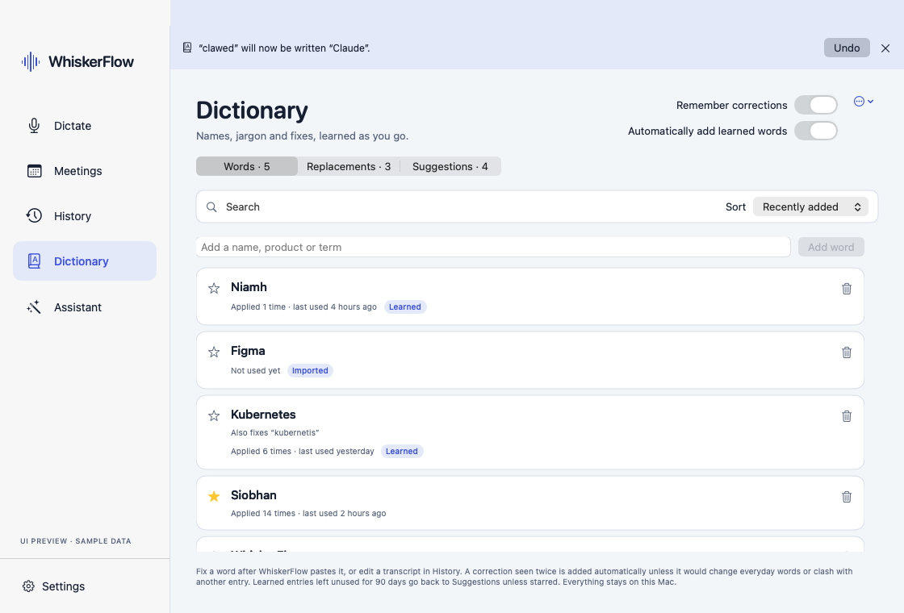
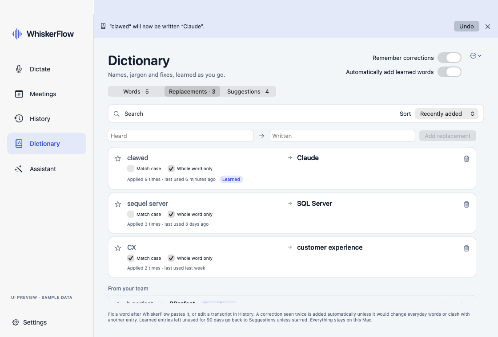
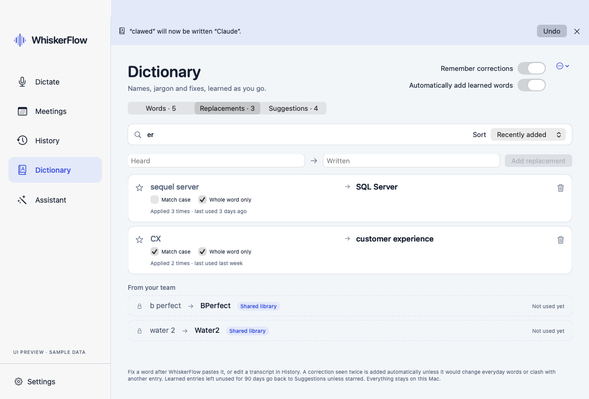
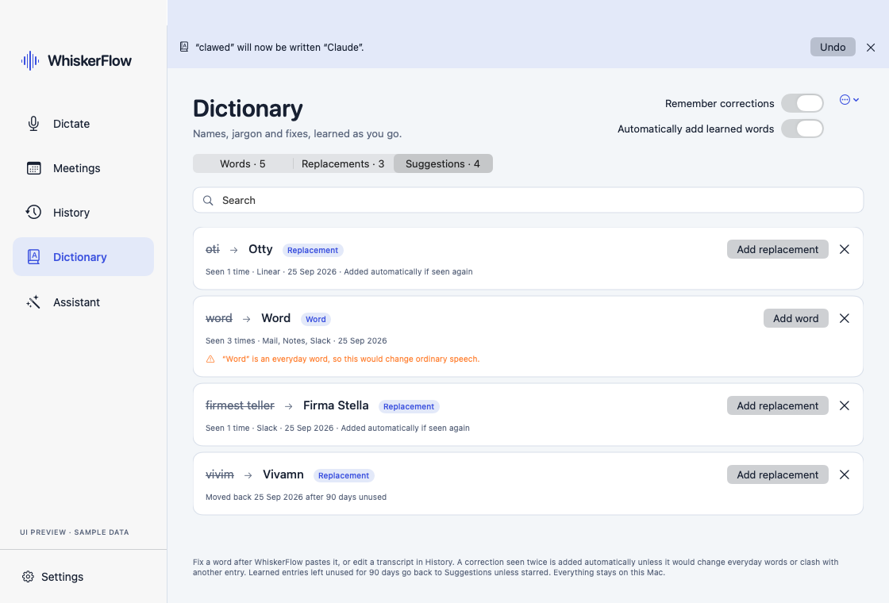

# Dictionary: recogniser biasing validation (2026-09-25)

The Dictionary now feeds its Words and the written side of its Replacements to
the recognisers. Each engine has its own switch under **Settings → Text →
Recogniser hints**. Post-recognition replacement still runs afterwards in every
case, as the safety net.

| Engine | What biasing does | Default | Why |
| --- | --- | --- | --- |
| Apple Speech | Sets `SFSpeechRecognitionRequest.contextualStrings` (up to 100 phrases) | **On** | Apple's documented, no-cost mechanism. Not measured here (see below). |
| WhisperKit | Sends a ≤64-token glossary as Whisper's previous-text prompt (`DecodingOptions.promptTokens`) | Off | Large accuracy gain, no hallucination or repetition seen, but 2.5–6× slower decodes. |
| Parakeet TDT v3 | Runs FluidAudio's CTC keyword spotting and rescoring pass (`VocabularyBoostingSession`) | Off | Real gain, but it needs a 98 MB English-only model, adds ~0.2 s, and made one wrong swap. |

## Why WhisperKit prompting was "removed"

The brief said the WhisperKit `initialPrompt` had been removed because it caused
hallucination or repetition. The git history doesn't support that:

- `TranscriptionRequest.initialPrompt` existed from the first rebuild
  (`6d46079`, 2026-06-05).
- Every call site passed `initialPrompt: nil`, and `WhisperKitEngine` never read
  the field. No commit on this branch ever set `DecodingOptions.promptTokens`.
- The field was deleted as dead code in `02e3ec1` ("refactor: remove dead
  abstractions and low-value tests", 2026-09-04). The README records the removal
  in `59e76f2`.
- No test, validation note or diagnostic mentions prompt-induced hallucination.

So there was no evidence to reuse. The known risk with Whisper prompts is real,
though: Whisper can echo or continue its previous-text context, especially on
silence. So the experiment below tests exactly that.

## Method

`Tests/WhiskerFlowTests/RecognizerBiasingEvaluationTests.swift` is an opt-in
test (`WHISKERFLOW_BIAS_EVAL_OUTPUT=/path.json swift test --filter
RecognizerBiasingEvaluationTests`).

**Audio.** Ten clips, all synthetic, so no user audio is involved:

- Five sentences packed with dictionary terms. These use the ten shared-library
  client names (BPerfect, Cleens, Comfybedss, Firma Stella, Manukora, Nuve, Otty,
  Travlfi, Vivamn, Water2) plus Siobhan, Niamh, WhiskerFlow, Kubernetes,
  Superlog and Figma. They are spoken by the macOS `Daniel` (en-GB) and
  `Samantha` (en-US) voices at 16 kHz.
- One prose control with no dictionary terms.
- A one-word clip ("Yes.").
- 5 s of digital silence.
- 5 s of low white noise (±0.004).
- A clip with a 4 s pause between two sentences.

**Hints.** 16 terms, built by `DictionaryBiasing.terms`, the same function the
app uses.

**Paths.** Each clip runs with hints off and on, through the paths the app uses:

- WhisperKit: the release-time bounded file decode and the live streaming
  sample decode, on tiny.en, base.en and small.en.
- Parakeet: the captured-sample decode.

**Measures:**

- "Terms right": dictionary terms spelled exactly (case-sensitive) in the *raw
  recogniser output*, before any post-recognition replacement.
- "Leaked": a hint term appearing in output when it wasn't spoken.
- "Max repeated trigram": the highest count of any repeated three-word run.

The results are raw recogniser output: shared-library replacements were not
applied.

## Results

| Engine | Path | Terms right (off → on) | Median ms, term clips (off → on) | Prose control unchanged | Silence, noise (off → on) | Leaked terms (on) | Max repeated trigram (on) |
| --- | --- | --- | --- | --- | --- | --- | --- |
| WhisperKit tiny.en | file | 4/15 → **13/15** | 85 → 213 | yes | `[BLANK_AUDIO]`, `[BLANK_AUDIO]` → same | 0 | 1 |
| WhisperKit tiny.en | live | 4/15 → **12/15** | 54 → 190 | yes | `you`, `[BLANK_AUDIO]` → `you`, `[ Sound Effects ]` | 0 | 1 |
| WhisperKit base.en | file | 4/15 → **12/15** | 114 → 320 | yes | `you`, `(clippers buzzing)` → empty, empty | 0 | 1 |
| WhisperKit base.en | live | 4/15 → **12/15** | 87 → 298 | yes | `you`, `(clippers buzzing)` → `You`, `(water rushing)` | 0 | 1 |
| WhisperKit small.en | file | 2/15 → **15/15** | 278 → 1442 | yes | `[BLANK_AUDIO]`, `[` → empty, `[` | 0 | 1 |
| WhisperKit small.en | live | 2/15 → **15/15** | 236 → 1220 | yes | `you`, `[BLANK_AUDIO]` → empty, `(water running)` | 0 | 1 |
| Parakeet TDT v3 | capture | 3/15 → **9/15** | 138 → 358 | yes | empty, empty → empty, empty | **1** | 1 |

The one-word clip and the long-pause clip gave the same output with hints off
and on, on every engine. For the one-word clip that output is a pre-existing
failure: the bounded WhisperKit file path fails on "Yes." either way.

### Before/after examples (raw recogniser output)

**WhisperKit tiny.en (the default WhisperKit model), file path**

| Hints off | Hints on |
| --- | --- |
| the travel fee launch moved. So Nive will update the firmest telebreath. | The Travlfi launch moved. So Niamh will update the Firma Stella brief. |
| Comforbeds and cleans both asked about the B perfect bundle. | Comfybedss and Cleens both asked about the BPerfect bundle. |
| Deploy Whisker float a Cuban eats and log it in Superlog. | The Play WhiskerFlow to Kubernetes and Logit in Superlog. |

**WhisperKit small.en, file path**

| Hints off | Hints on |
| --- | --- |
| Send the Manukoro and Oti reports to Shavon before Friday. | Send the Manukora and Otty reports to Siobhan before Friday. |
| Vivum wants the new landing page in Figma by Tuesday. | Vivamn wants the Nuve landing page in Figma by Tuesday. |

**Parakeet TDT v3**

| Hints off | Hints on |
| --- | --- |
| Send the Manupura and Oti reports to Shavan before Friday. | Send the Manukora and Oti reports to Shavan before Friday. |
| Comfabeds and cleans both asked about the be perfect bundle. | Comfybedss and Cleens both asked about the be BPerfect bundle. |
| The travel fee launch moved, so Neve will update the firm's telebrief. | The Travlfi launch moved, so **Nuve** will update the firm's telebrief. |

## Findings

### WhisperKit

**Hallucination and repetition.** None was caused by the prompt in this set:

- No leaked terms in 60 biased decodes.
- No repeated trigrams.
- The prose control was identical with and without the prompt.
- On silence and noise, the prompt never produced dictionary words. It made
  Whisper more likely to return nothing, where it had been inventing "you" or
  "(clippers buzzing)". An empty file decode is reported as no speech, which the
  app already discards.
- The noise labels such as "(water rushing)" appear with or without the prompt.

**Accuracy.** A large gain: the default tiny.en went from 4/15 to 13/15 names
right, and small.en to 15/15. One regression came with it on tiny.en: "Deploy"
was heard as "The Play" with the prompt.

**Cost.** Latency. Prompt tokens are prefilled one at a time, so every decode
pays for them:

- About +130 ms on tiny.en and +210 ms on base.en.
- About +1.1 s on small.en.
- The worst case was 7.2 s on 5 s of silence with small.en (175 ms without),
  because temperature fallback re-runs the prompted decode.

Live streaming decodes several times a second, so it pays that cost on every
pass.

**Decision.** The code is back, behind the switch, and **off by default**. The
brief's condition, that it doesn't cause hallucination or repetition, holds for
this set. But speed is WhiskerFlow's first priority, and the evidence is
synthetic speech only. Turn it on for name-heavy work on tiny.en or base.en.

### Parakeet TDT v3

FluidAudio 0.15.6 has no decode-time biasing for TDT: `AsrManager` and
`ASRConfig` take no vocabulary. The `transcribe(_:customVocabulary:)` example in
its docs does not exist in this version.

What it does ship is `VocabularyBoostingSession`. After the TDT decode, this
runs a separate CTC model (`parakeet-ctc-110m`, ~98 MB, downloaded once to
FluidAudio's cache) over the same audio. It then swaps words for dictionary
terms when the acoustic evidence favours the term. WhiskerFlow uses that pass
unchanged:

- It never waits for the download.
- It gives the pass a 2 s deadline.
- It skips audio over 120 s.
- It falls back to the unboosted text on any failure.

**Accuracy.** 3/15 → 9/15 terms right.

**Errors.** It made two:

- It replaced "Neve" (really "Niamh") with a *different* dictionary term,
  "Nuve". That's a wrong substitution the user would not expect.
- It left the spurious "be" of "be perfect" before "BPerfect".

**Other limits:**

- The CTC model is English-only.
- Each decode costs about +220 ms.

**Decision.** Available, but **off by default**.

### Apple Speech

**Not measured.** `SFSpeechRecognizer` needs Speech Recognition permission, and
the `swift test` runner has no usage description. TCC terminates it on the first
request, which is what happened here. Measuring it needs the signed app bundle
and a user to grant permission.

The change itself is small:

- It uses the documented `contextualStrings` API, capped at Apple's recommended
  100 phrases.
- Recognition stays on-device (`requiresOnDeviceRecognition` whenever the
  recogniser supports it).
- It adds no model or download.

**Decision.** It stays on by default.

## Limits of this evaluation

- The speech is synthetic, from two voices. Real microphones, accents and
  background speech will do worse on both sides of each comparison.
- The prose control is a single sentence. A false-positive rate for Parakeet's
  rescoring needs more real speech than was available here.
- The dictionary had 16 terms. Much larger ones may shift both the gains and
  the Parakeet false positives. FluidAudio tightens its thresholds as the
  vocabulary grows.

## The Dictionary screen

The screenshots were rendered from the debug UI preview with sample data
(`script/preview_ui.sh --ui-destination=Dictionary --ui-dictionary-tab=<tab>
--ui-snapshot=<png>`).

**Words** (`2026-09-25-dictionary/words.png`) shows:

- Stars, usage counts with last-used times, and Learned/Imported badges.
- A learned spelling fix kept as "Also fixes".
- The app-wide Undo notice for the latest automatic addition.

**Replacements** (`2026-09-25-dictionary/replacements.png`,
`2026-09-25-dictionary/replacements-team.png`) shows heard → written with the
match-case and whole-word options. Shared-library entries are read-only and
labelled by source.

**Suggestions** (`2026-09-25-dictionary/suggestions.png`) shows three kinds of
pair waiting for a decision:

- Pairs seen once, which are added automatically if seen again.
- A pair blocked by the common-word policy, with the reason shown.
- An entry demoted after 90 days unused.

## Migration smoke test

The real (non-preview) app was launched against a throwaway
`CFFIXED_USER_HOME`, under a separate bundle ID. Its defaults held a legacy
vocabulary of `clawed → Claude` and `iphone → iPhone`.

On launch it:

- Wrote `Dictionary/dictionary.json` with `clawed → Claude` as a Replacement
  and `iPhone` as a Word, both marked `migrated`, keeping their IDs and flags.
- Left the legacy `vocabulary` defaults key byte-for-byte intact.
- Ran for 15 s without errors.

`corrections.json` is still the correction log that Suggestions are built from,
so nothing in it moves or is rewritten.
