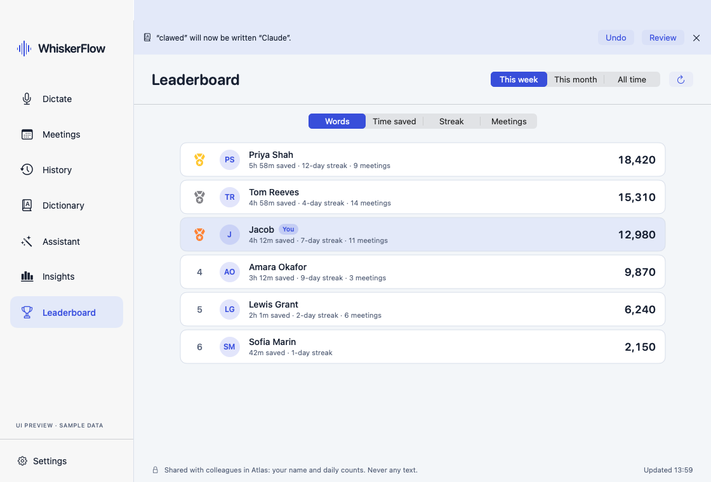
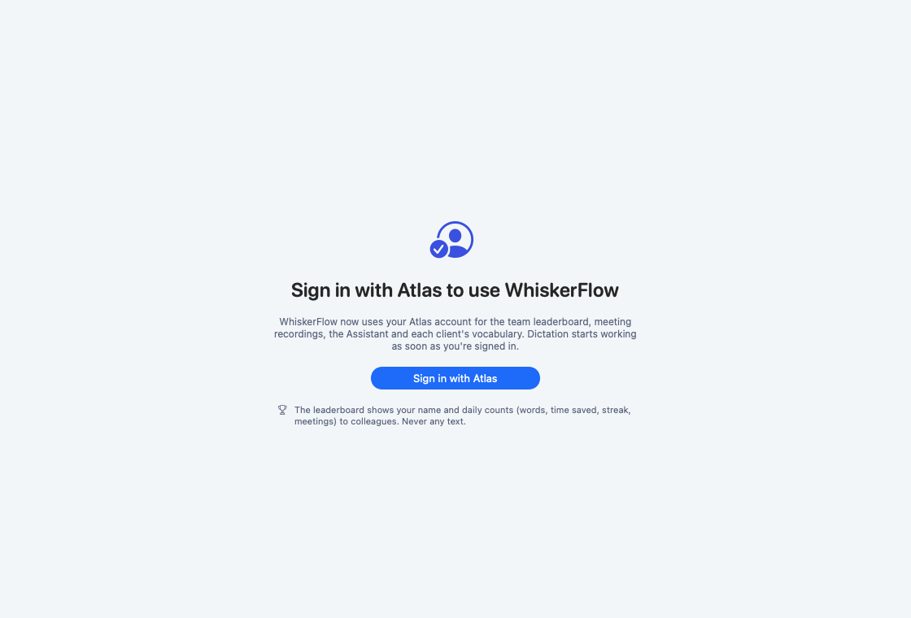

# Company leaderboard and required Atlas sign-in

Branch `claude/meeting-library`. Atlas side: PR thatworkagency/atlas#3697 (`notetaker.leaderboard.report` and `notetaker.leaderboard.get`, new `whiskerflow` feature permission).

## What WhiskerFlow sends

Once at launch and then every 15 minutes, `notetaker.leaderboard.report` carries one object per local day:
- words, dictations and speaking seconds, from the Insights store;
- time saved, at the standard 40 wpm typing speed for everyone rather than each person's own setting;
- meetings recorded (over a minute each) and their length, from a small per-day tally. The tally is kept apart from the meeting library, because retention can delete an entry right after delivery.

It never sends text, app names, meeting titles or transcripts.

**What gets sent:**
- The first report sends the whole history, in batches of up to 400 days.
- Later reports send only yesterday and today. Atlas keeps the last value for each day, and History retention may since have trimmed older days.
- A failed report is retried in full on the next one.

## Leaderboard screen

Sidebar → Leaderboard (⌘7):
- **Period:** this week, this month or all time.
- **Rank by:** words, time saved, streak or meetings.
- Ties share a rank, and people with nothing in the period are left off. You always appear, highlighted.
- Streaks come from Atlas. They count consecutive days with a dictation across all of a person's Macs, and a streak isn't broken until a day ends without one.

## Required sign-in

A production build without an Atlas device token shows only the sign-in screen. The dictation key doesn't record: it brings the window forward and says "Sign in with Atlas to start dictating." Setup (permissions) follows sign-in. Tests and the UI preview are exempt, and so are DEBUG runs with `WHISKERFLOW_SKIP_ATLAS_SIGN_IN=1`.

**Order of rollout:** deploy Atlas#3697 before shipping this build to everyone. Before that PR, pairing needs meetings Write access, which Finance and Contractor roles don't have by default, so those people would be locked out of dictation.

## Verified

- Core: 11 tests (day rows, time saved at the standard speed, clamping to Atlas's caps, first and later report windows, window start days, ranking and ties, decoding).
- Controller, against a stubbed Atlas: 5 tests (400-day batches, recent days only after the first report, retry after failure, period `since`, the permission message keeps the last board, signed out sends nothing, meeting tally and one-time seeding).
- Full suite: 738 tests, 16 opt-in skips, 0 failures.
- Not verified live: the Atlas tools aren't deployed yet.
