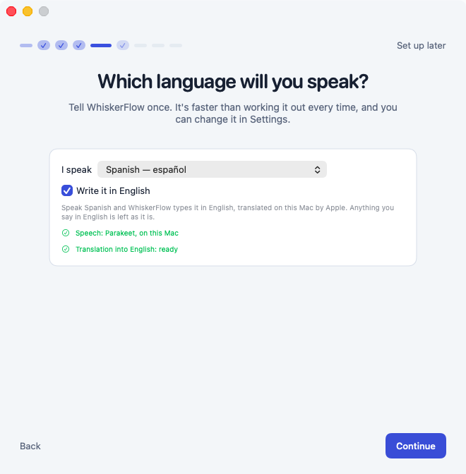

# Dictate in your own language, typed in English

Jacob's team is international. People dictate in their own language, and WhiskerFlow types it in English, translated on the Mac. People tell WhiskerFlow their language once, in setup or in Settings, so no dictation pays for detecting it.

## How it works

1. **Recognition, picked from the chosen language** (`DictationLanguagePlan`, AppSupport, unit-tested).
   - **Parakeet** for its 25 European languages, including English, Spanish, German, French, Portuguese, Polish, Ukrainian and Russian.
   - **Apple's on-device dictation model** (`DictationTranscriber` / `SpeechAnalyzer`, macOS 26) for Arabic, Catalan, Cantonese, Chinese (Simplified and Traditional), Hebrew, Hindi, Indonesian, Japanese, Korean, Malay, Norwegian, Thai, Turkish and Vietnamese.
     - Each language's model downloads once, in about 20 s, with no prompt and no Speech Recognition permission.
     - The older Apple Speech fallback is switched off for these languages, because it sends most of them to Apple's servers.
2. **Translation into English** with Apple's Translation framework, on the Mac.
   - On macOS 26.4 and later it asks for the `.highFidelity` strategy (Apple Intelligence). This Mac (26.6) has that model and not the `.lowLatency` one.
   - Dictionary words are marked to stay untranslated: names, products and clients.
   - Text that already reads as English is left alone, because bilingual people switch languages mid-sentence. The check uses NaturalLanguage and takes under 1 ms.
   - If a language's translation isn't downloaded, the words are typed as heard. A banner says how to fix it.
3. **Formatting** (filler words, punctuation and the dictionary) then runs on the English text.

**Language packs:** translation downloads need macOS's own confirmation sheet. Settings and setup offer a Download button, which uses `translationTask` and `prepareTranslation()`.

**Speed:** the translator is warmed at launch and again on the key press while you're still speaking, after a minute idle. That's needed because the first translation for a language is slow.

**Auto-detect:** it remains for European languages. Parakeet hears any of them, and the transcript's language decides whether to translate.

## Setup and Settings

There's a new setup screen after Shortcut: "Which language will you speak?" It starts from the Mac's preferred language and has a "Write it in English" switch, on by default. Settings → Dictation → Language has the same controls. Both show what the language needs on this Mac: Parakeet, or Apple's speech model (downloading or ready), and the translation status (ready, Download, or not offered by Apple).

## Measured on this Mac (silent: speech synthesised to files with `say -o`)

`WHISKERFLOW_TRANSLATION_PROBE=1 swift test --filter DictationTranslationTests`

| Language | Recogniser | Recognise | Translate | English |
| --- | --- | --- | --- | --- |
| Spanish | Parakeet | 94 ms | 5.2 s (cold) | Hey, can you send Sara the sales report before Friday? Thanks. |
| German | Parakeet | 83 ms | 566 ms | I have revised the draft, please take a look at it again. |
| Japanese | Apple dictation | 2.3 s (first load) | 856 ms | Can I change tomorrow's meeting from 15:00? |
| Chinese | Apple dictation | 858 ms | 736 ms | We can have a meeting next Monday to discuss it. You can figure it out. |

- **Speed:** warm translation took 230–400 ms per sentence in a separate probe. The first translation of a language after loading took 1–5 s, which is why the translator is warmed on the key press.
- **Accuracy:** the Chinese error ("你去算吧" for "讨论一下预算吗") is recognition of synthetic speech, not translation.
- **Language coverage of Apple's translation on this Mac:** most languages above. Bulgarian, Croatian, Czech, Estonian, Finnish, Greek, Hungarian, Latvian, Lithuanian, Maltese, Romanian, Slovak, Slovenian, Catalan, Hebrew and Malay currently have no English translation from Apple. For those the controls say so, and the text is typed as spoken.

## Not verified

- Real voices, and accented English in the "already English" check.
- The `.highFidelity` model staying on the Mac. Apple describes Translation as on-device, but this wasn't tested with the network off.
- The translation download sheet, and the HUD preview: there is none for Apple-dictation languages, and the Parakeet preview shows the original language.
